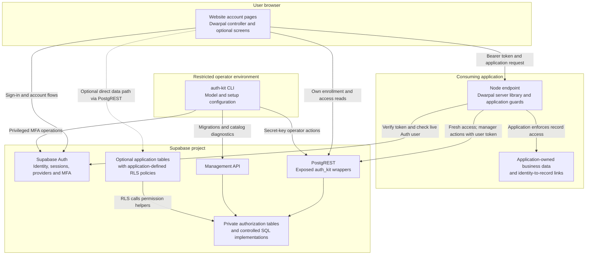
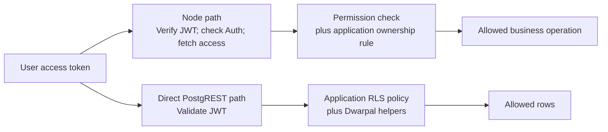

# Architecture overview

Dwarpal is a browser kit, a Node library, database migrations and an operator CLI around Supabase Auth. A consuming application imports the library and owns its business-data endpoints. There is no separately deployed Dwarpal network service.

This overview describes the implementation at contract `0.5`. It supplements the [business requirements](brd.md), [detailed design](design.md) and [RBAC LLD](rbac-lld.md). The [verification status](../README.md#verification-status) distinguishes locally checked behavior from hosted guarantees awaiting verification.

## Components and trust boundaries

Arrows show logical calls, not deployment instructions or extra credentials. PostgREST exposes the approved wrappers and selected consumer schemas; it must not expose `auth_kit_private`. Its private SQL implementations are reached through controlled grants and wrappers. See the [callable-surface rules](rbac-lld.md#42-functions-and-who-may-call-them) for the exact HTTP and SQL distinction.

| Boundary | Credentials and authority |
| --- | --- |
| Browser | Publishable key and the signed-in user's tokens. UI state is not an authorization boundary. |
| Application server | Publishable key and the current request's token; a fixed client ID. Resolves access without the project secret key. |
| Operator | Project secret key for privileged operations; a Management API token for migrations and full catalog diagnostics. Keep these outside the browser and web-server request path. |
| Database | Enforces client scoping, controlled membership/model changes and audited writes. Applications author their own business-row policies. |

## Component responsibilities

| Component | Responsibility and dependencies |
| --- | --- |
| Core | Pure validation and access evaluation shared by consumers; no network or database dependency. |
| Browser | Uses Supabase's browser client for account flows; uses core rules and the SQL access snapshot to present the current state. Ships optional screens and prebuilt static assets. |
| Server | Verifies JWTs, checks Auth and fetches fresh access for each request. Produces a client-scoped `Principal`; exposes permission guards and manager operations. |
| SQL | Stores roles, permission mappings, enrollment, memberships and audit/request records. Enforces invariants and exposes optional RLS helpers. |
| Operator | Applies migrations and models and performs privileged administration. Its separate import keeps secret-key operations out of ordinary application imports. |
| Application | Owns business records, record-level guards, identity links, HTTP responses, hosting and route integration. |

The [source map](start-here.md#what-has-been-built) links to each component. The emulator, test harness and examples support development and verification; they are not runtime services shipped with the package.

## Two data-access paths

| Question | Node path | Direct database RLS path |
| --- | --- | --- |
| Where does the data live? | Any store behind the application's endpoint. | Application tables in Supabase Postgres. |
| Who evaluates business-record ownership? | Application code after checking permission. | Application-authored RLS policies. |
| Are memberships read live? | A fresh access snapshot on every resolved request. | Helpers consult current database memberships. |
| Is Auth checked live? | Yes, on every resolved request. | No additional live Auth call by the RLS helpers. |
| Session revocation guarantee in the design | Reject on the next request after Auth recognizes revocation. Hosted verification is pending. | An already issued token may continue to work until it expires. |
| Appropriate use | Protected operations requiring live Auth checks; sensitive data. | Cases where the deployment accepts the session-revocation window. |

Membership revocation and session revocation are different: removing a role changes the live access model; signing out or banning a user does not itself invalidate every already issued token on the direct path. The [paired sequence diagrams](rbac-lld.md#s4-request-time-authorization-in-your-web-application) and [revocation test case L25](design.md#9-test-plan) make that distinction explicit.

## Access and state ownership

Supabase Auth owns identity, sessions and MFA factors. The kit owns website enrollment and role/permission membership. The application owns its business records and any audited links from identity IDs to those records. Verified email is an identity attribute, not proof that a user owns an existing business record.

A principal contains only the configured client's memberships. Effective permissions are the union of active roles. A role requiring MFA is inactive until the session reaches `aal2`; permissions from other active roles remain available. The application must check the particular permission and then enforce any record-ownership condition.

Enrollment is durable and separate from membership. Retrying a first join cannot duplicate enrollment, and signing in after a membership is revoked cannot grant it back. Privileged writes use controlled SQL functions; request-bearing mutations record replay outcomes, including no-ops. The LLD explains transaction boundaries, serialization, conflicting retries and MFA-reset recovery.

Browser tokens are persisted through Supabase's client in `localStorage`. This makes script injection a credential risk; the consuming application owns its script trust and Content Security Policy. The current package has no cookie-session or backend-for-frontend mode.

## Key low-level diagrams

| Diagram | Design question |
| --- | --- |
| [Entity model](rbac-lld.md#3-data-model) | What connects clients, roles, permissions, users, enrollment and audit history? |
| [First initialization](rbac-lld.md#s1-first-time-initialisation) | How does an empty installation reach its first manager? |
| [Second website](rbac-lld.md#s2-onboarding-a-second-brand) | What changes when the same package serves another brand? |
| [Signup and join](rbac-lld.md#s3-public-sign-up-and-join) | How are account creation and one-time enrollment separated? |
| [Node authorization](rbac-lld.md#s4-request-time-authorization-in-your-web-application) | Which checks happen on each protected request? |
| [Direct RLS](rbac-lld.md#s4b-the-direct-rls-path-and-what-it-does-not-check) | Which checks happen without the Node library? |
| [Manager grant](rbac-lld.md#s5-a-manager-grants-a-staff-role) | How is delegated membership administration bounded? |
| [Model change](rbac-lld.md#s6-changing-the-permission-model-after-go-live) | How are concurrent or unsafe permission-model changes handled? |

For abnormal conditions, read the [LLD failure modes](rbac-lld.md#8-failure-modes), [MFA reset protocol](rbac-lld.md#44-mfa-reset-reserve-then-act-under-one-claim), and [manual error handling](manual.md#10-errors). For an integration, continue with the [manual](manual.md#5-integration-steps).
