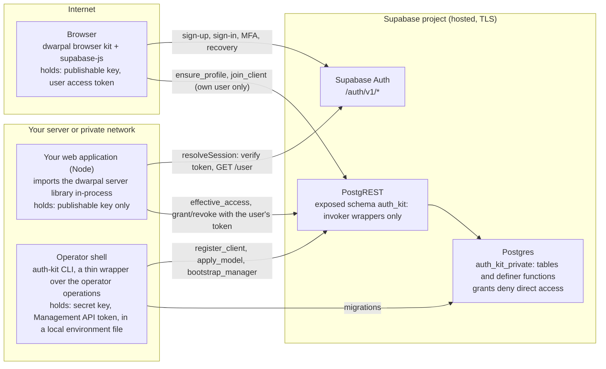
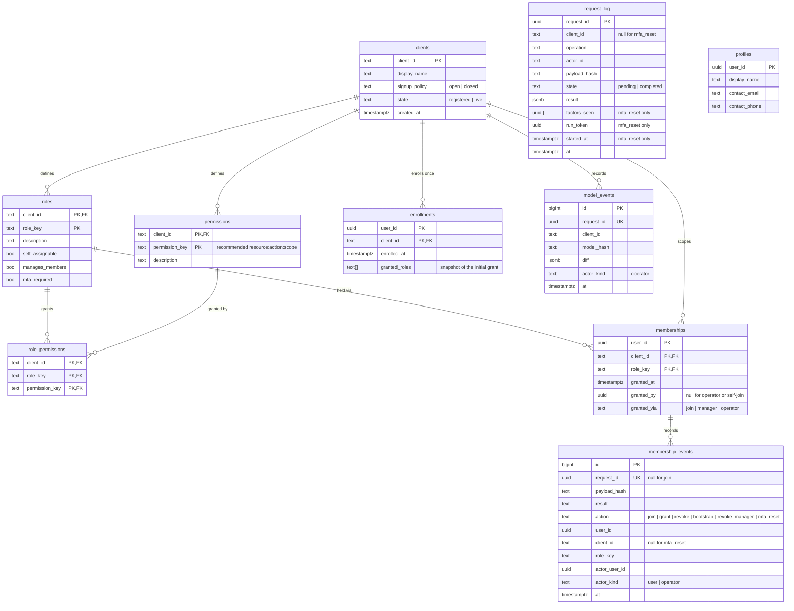
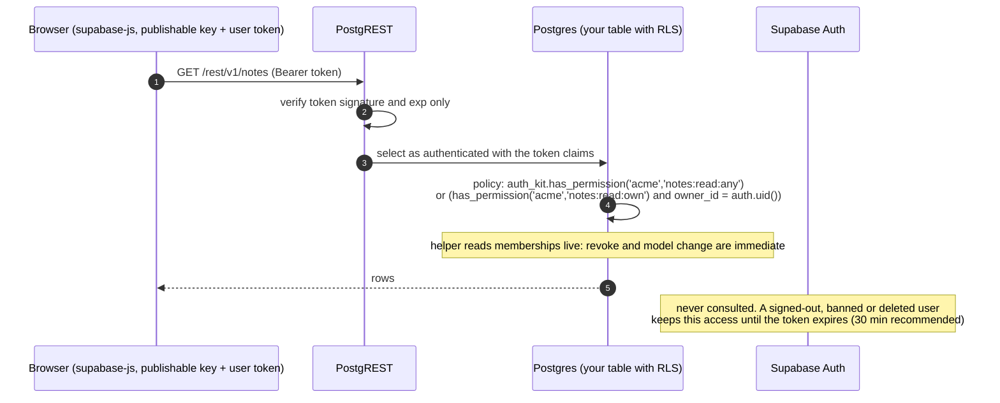
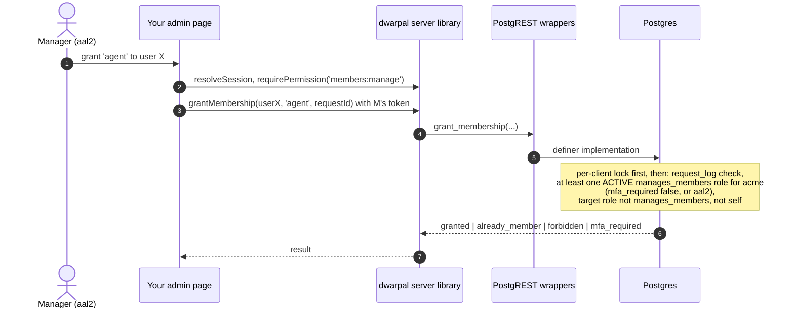

# Dwarpal RBAC low-level design

This document explains how Dwarpal's roles, permissions and memberships work in SQL, why the design is shaped this way, and how it behaves under retries, concurrency and partial failure. The contract itself is in the [design](design.md); integration steps are in the [user manual](manual.md).

Diagrams are Mermaid and render on GitHub.

## 1. Three surfaces, one contract

Dwarpal is a **library plus SQL**, not a service. It has no network API of its own, so there is nothing that browsers or external services can call beyond Supabase's own endpoints and a small set of SQL wrappers. Your web application uses the library under a fixed contract; a client configures only runtime data and its own configuration.



| Surface | Caller | Credential | Can do |
| --- | --- | --- | --- |
| Browser | the end user's browser | publishable key and that user's access token | Supabase Auth endpoints; two wrappers that act only on the caller's own user |
| Server library | your web application, in-process | publishable key and the request's access token | resolve a session, compute permissions, forward manager actions under the manager's own token |
| Operator | a person or deploy step with the project's secret key | secret key and Management API token | migrations, client registration, permission model, first manager |

What a client **cannot change**: function signatures, the SQL functions, their grants and the invariants in section 5. These ship in the package and its versioned migrations.

What a client **configures**: `ClientConfig` (branding, routes, providers, session policy) and the **model data** (roles, permissions, role-to-permission map, memberships), all written through the kit's own functions.

Two limits follow from the platform:

- **The data is hosted.** Supabase runs in Supabase's cloud, so "same machine" applies to your web application and the library, not to the database. Every hop to Supabase is TLS with a per-user token or the operator key.
- **The secret key is root for the project.** Supabase's `service_role` bypasses row security. A secret-key holder who deliberately writes tables instead of calling the functions can break the invariants. The kit keeps the secret key off the web application and the browser, records every sanctioned write as an event, and `auth-kit doctor` reports drift such as memberships without a matching event. This is inherent to Supabase.

## 2. Why RBAC, and where it stops

The simplest alternative is a fixed set of role names, with each consumer deciding in code what a role may do, for example `requireRole(principal, ['staff', 'admin'])`. That is smaller and typo-proof at compile time, but it does not generalise:

| Aspect | Fixed role names | Client-defined roles with RBAC |
| --- | --- | --- |
| Adding a role | a code change in the kit and every consumer | a data change |
| What a role may do | scattered across consumers, which can disagree | one model per client, one answer |
| Consumer check | role-name comparison | permission-key check |
| A typo | compile error | denied at runtime (fail closed); `explain()` shows why |
| Reusable for another website | no | yes |
| Row-level ownership | consumer | consumer |

The limits of the RBAC design are deliberate:

1. **RBAC is type-level, not row-level.** It answers "may a buyer read orders", never "may this buyer read order 123". The consumer keeps its ownership check. Going further needs a relationship engine such as OpenFGA or SpiceDB, which needs a server this stack does not have.
2. **A wrong model is a data bug.** A role mapped to the wrong permission is silent until tested. Mitigations: `apply_model` validates the whole model before writing, `doctor` reports unmapped permissions and roles with no members, and the hosted actor matrix runs per model state.
3. **Several roles per user need union semantics with an MFA subtlety.** Section 4.3 defines them exactly.

## 3. Data model



Constraints that carry design intent:

- `roles`: `check (not (self_assignable and manages_members))`. A role that public sign-up can obtain can never manage members.
- `role_permissions`: composite foreign keys on `(client_id, role_key)` and `(client_id, permission_key)`, so a role cannot be mapped to another client's permission.
- `memberships → roles`: `on delete restrict`. A role in use cannot be deleted; revoke first.
- `role_permissions → permissions`: `on delete restrict`. A mapped permission cannot be deleted; unmap first. `apply_model` orders its own operations so that a single model-file change still applies in one transaction.
- One user may hold several roles for one client. Effective permissions are the union (section 4.3).
- `enrollments`: primary key `(user_id, client_id)`, written once by a successful `join_client`, never updated or deleted by any function. It is the durable fact "this user's public initial grant happened", independent of which memberships still exist. A manager's revoke therefore sticks: the next sign-in finds the row and grants nothing.
- `clients.state`: `registered` on `register_client`, `live` on the first successful `bootstrap_manager`. Once live, `apply_model` refuses a model that would leave the client with no assigned manager.
- `request_log`: one row per request-bearing command, written **whether or not anything changed**. The retry rule reads this table, not the event tables: same id and hash → stored `result`; same id and another hash → `request_conflict`. Events record mutations; `request_log` records outcomes. The fingerprint is `sha256(canonical JSON of {operation, client_id, actor_id, payload})`, so an id is bound to its actor and cannot be replayed by another manager. `state`, `factors_seen`, `run_token` and `started_at` exist for `mfa_reset` only: `run_token` names the current claim holder and `started_at` is reset on takeover. Every other command inserts a `completed` row in its own transaction.
- `membership_events.payload_hash` and `result` are kept for audit display; they are not the retry lookup.

All tables except `profiles` live in `auth_kit_private`. No PostgREST role has direct table privileges. The exposed schema `auth_kit` holds only invoker wrappers, the RLS helpers, `profiles` and the `public_clients` view. There are two different fences:

- PostgREST **routing** reaches only schemas in the project's exposed list, and `auth_kit_private` is never listed, so no HTTP call can address an implementation.
- SQL **privileges** (`EXECUTE`, `USAGE`) stop a caller who already runs SQL as `authenticated`.

Both are asserted, and they are tested differently: routing over HTTP, privileges by SQL impersonation.

## 4. Reserved flags, functions and evaluation

### 4.1 The three reserved flags

| Flag | Meaning the kit enforces | Set by |
| --- | --- | --- |
| `self_assignable` | `join_client` grants this role to a verified user at their one enrollment | operator, in the model |
| `manages_members` | a holder may grant and revoke non-manager roles for this client; bootstrap must name such a role | operator, in the model |
| `mfa_required` | permissions from this role count only in an `aal2` session; the browser kit prompts enrolment | operator, in the model |

Everything else about a role is client data: its key, description and permission set.

### 4.2 Functions and who may call them

Each function is a wrapper in `auth_kit` that calls an implementation in `auth_kit_private`. The full rules are in [design section 4.6](design.md#46-sql-surface); this table summarises the checks.

| Function | Caller | Checks inside SQL |
| --- | --- | --- |
| `ensure_profile()` | authenticated user | upserts own row only |
| `join_client(client_id)` | authenticated user | lock; email confirmed (from `auth.users`, not the token); `unknown_client` if missing; **`already_enrolled` if an enrollment row exists, writing nothing whatever the current memberships are**; `closed` if `signup_policy = closed`; `no_default_role` if no `self_assignable` role (nothing written, retryable); otherwise inserts the enrollment row, one membership per `self_assignable` role and one `join` event each, and returns `enrolled`. One transaction. |
| `effective_access(client_id)` | authenticated user | returns `enrolled_at` and own memberships with each role's flags and permissions; read-only; no lock |
| `grant_membership(user_id, client_id, role_key, request_id)` | authenticated manager | lock, then the `request_id` check, then manager authority: **at least one held `manages_members` role for that client is active**; held but none active → `mfa_required`; none held → `forbidden`; target role is **not** `manages_members`; target user exists and is confirmed; not self. The only path that restores a revoked self-assignable role. |
| `revoke_membership(user_id, client_id, role_key, request_id)` | authenticated manager | same caller checks; cannot revoke a `manages_members` role |
| `bootstrap_manager(user_id, client_id, role_key, request_id)` | operator (`service_role` only) | lock; role has `manages_members`; user confirmed; idempotent; sets `clients.state = live` |
| `revoke_manager(user_id, client_id, role_key, request_id)` | operator | lock; `request_id` check; refuses if it would leave zero managers for the client |
| `register_client(client_id, display_name, signup_policy)` | operator | idempotent on `client_id`; no `request_id` |
| `apply_model(client_id, model jsonb, request_id, dry_run)` | operator | lock; validates the whole model, including two live-client guards: never set `manages_members` on a role that has holders, and on a `live` client never leave zero assigned managers; computes the diff annotated with reach (`future_joiners` for `self_assignable` changes, `holders: N` for mapping changes); applies in one transaction; one `model_events` row |
| `export_model(client_id)` | operator | read-only; returns the current model in file format plus the last applied hash |
| `mfa_reset_begin`, `mfa_reset_note`, `mfa_reset_finish` | operator | project-wide lock; reserve-then-act with a single claim (section 4.4) |

Promotion to a manager role is **operator only**, and only through `bootstrap_manager`. Neither a manager nor a model change can promote existing holders, so a compromised manager account cannot mint more managers. This is stricter than typical admin consoles.

**One lock, checked-after semantics.** Every write function, including `join_client`, begins with `pg_advisory_xact_lock(hashtext('auth_kit:' || client_id))` and only then checks authority and state. Model writes and membership writes for one client are therefore serialised against each other, and a manager revoked by a concurrent transaction is seen. Reads never wait.

**Request semantics.** Every request-bearing function writes a `request_log` row with the fingerprint and the result **on every first call, including no-ops** (unchanged model, `already_member`, `not_member`). A retry with the same id and payload returns the stored result and writes nothing. The same id with a different payload raises `request_conflict` and writes nothing. There is no third outcome. Storing the outcome only in event rows would not be enough: a no-op leaves no event, so a changed-payload retry after a no-op would otherwise succeed.

### 4.3 Evaluation: from the live snapshot, in-process

`resolveSession` makes one live call to Supabase Auth and one `effective_access(client_id)` read per request, which returns roles, flags and permissions in one round trip. Every check after that is a pure local function.

```ts
can(principal, 'orders:read:any'): boolean
canAll(principal, ['orders:read:any', 'orders:cancel:any']): boolean
canAny(principal, [...]): boolean
explain(principal, 'orders:read:any'): { allowed: boolean; via: string[]; withheld: { role: string; reason: 'mfa_required' }[] }
requirePermission(principal, 'orders:read:own')   // throws AuthError('forbidden') or AuthError('mfa_required')
```

Union rule: a permission is held if at least one **active** role grants it. A role is active when it is not `mfa_required`, or when the session is `aal2`. A user holding `buyer` and `agent` at `aal1` keeps the buyer's permissions and sees `mfaPending: true`; `explain` names `agent` as withheld. `requireRole` and the SQL `has_role` test **active** roles only; `access.roles` is display data.

**Own versus any.** Union means a lesser role can hand a user a key, so one key must never mean both "own rows" and "all rows". Convention: `orders:read:own` and `orders:read:any`. `own` refers to the row being acted on; an action whose narrow scope is the principal as the target, such as assigning a lead to oneself, uses `:self` (`leads:assign:self`, with the guard "target assignee equals the principal's user id"). The consumer guard, in this exact order:

```ts
if (!can(principal, 'orders:read:any')) {           // broad branch needs an active role that grants it
  requirePermission(principal, 'orders:read:own');   // forbidden or mfa_required
  if (order.userId !== principal.identity.userId) throw new AuthError('forbidden');
}
```

The matching RLS policy for a consumer table in Supabase Postgres:

```sql
using (
  auth_kit.has_permission('acme', 'orders:read:any')
  or (auth_kit.has_permission('acme', 'orders:read:own') and owner_id = auth.uid())
)
```

A user with `buyer` and an inactive `agent` role fails the first test on both paths and is stopped by ownership on the second.

Two typical questions, answered by the API:

- "Does user A with Role1 have access to R4?" → `can(principal, 'R4:access')` is `false`, and `explain` shows no active role grants it.
- "Does A have access to R2, R3, R4 and R5?" → `canAll` is `false`; `explain` per key shows R2 and R3 via Role1, and R4 and R5 with no grantor.

### 4.4 MFA reset: reserve, then act, under one claim

Deleting a user's MFA factors happens in Supabase Auth through the admin API, while the audit lives in SQL, so the operation cannot run in one transaction. The design binds the request id in SQL before any Auth call and lets exactly one runner hold the right to complete it.

- `mfa_reset_begin` binds the id to `{mfa_reset, operator, user_id}` in a `pending` `request_log` row under the project-wide lock `hashtext('auth_kit:mfa_reset')`, before any Auth call. It answers `proceed` (new row, fresh `run_token`), the stored result (already completed), `resume` (a pending row older than the 120 s lease, with its recorded factor list), `request_in_progress` (pending inside the lease) or `request_conflict` (another user behind the same id).
- **Single claim.** On `resume`, the same statement under the lock replaces the row's `run_token` and sets `started_at = now()`. The next caller therefore sees a pending row inside the lease and gets `request_in_progress`. Without this, every caller after the lease would get `resume` and two takeovers could both reach Auth.
- `mfa_reset_note` records the factor list once, before the first deletion. `mfa_reset_finish` completes the row and writes the one event, with `client_id` null.
- Both check the caller's `run_token` **before** the row state and raise `run_superseded` on a mismatch without writing, so one runner completes the row and one event exists.
- The CLI stops itself with `lease_expired` before any admin API call once its claim is older than the lease minus the 20 s per-call timeout (100 s), measured on its own clock from the moment it sent `begin`. A slow runner therefore does not race a takeover. A superseded runner that reaches Auth late can only repeat deletions of already-recorded factors, which are idempotent.
- The factor list is never part of the fingerprint. A retry after success returns the stored result without touching Auth; a different user behind the same id conflicts before Auth; a crash mid-deletion resumes with the original list.

The complete outcome tables are in [design section 4.7](design.md#47-mfa-reset-reserve-then-act-under-one-claim).

## 5. Invariants the kit enforces

| # | Invariant | Where enforced |
| --- | --- | --- |
| I1 | Public sign-up and join can yield only `self_assignable` roles | `join_client` |
| I2 | A `self_assignable` role is never `manages_members` | table check constraint, `apply_model` |
| I3 | Only a manager of that client, or the operator, changes memberships | `grant_membership`, `revoke_membership` |
| I4 | Managers cannot grant or revoke manager roles | `grant_membership`, `revoke_membership` |
| I5 | A live client never drops to zero assigned managers, by revoke or by model change | `revoke_manager`, `apply_model` |
| I6 | An `mfa_required` role contributes nothing at `aal1` | `effective_access` and library evaluation, both |
| I7 | The permission model changes only through `apply_model`, in one transaction, with an event | grants, `apply_model` |
| I8 | Roles and permissions in use cannot be deleted | foreign keys `on delete restrict` |
| I9 | Every write for a client serialises on one per-client lock, checks authority after the lock, and treats a `request_id` retry as either the stored result or `request_conflict`, no-op first calls included | all write functions, `request_log` |
| I10 | No caller reads or writes tables directly through PostgREST | grant table asserted at the end of each migration |
| I11 | No claim in the token or user metadata grants anything; only table rows do | `effective_access` reads tables only |
| I12 | Public enrollment happens once per user per client; later sign-ins and retries never re-grant; a revoked self-assignable role returns only through a manager grant | `enrollments` primary key, `join_client` |
| I13 | Promotion to a manager role happens only through `bootstrap_manager`; neither a manager call nor a model change promotes existing holders | `grant_membership`, `apply_model` |
| I14 | Every authorization helper, in JS and SQL, evaluates active roles only | `packages/core`, `has_role_impl`, `has_permission_impl` |
| I15 | Manager authority is itself an active-role question: one active `manages_members` role suffices; a held but MFA-withheld manager role contributes nothing, and `mfa_required` is returned only when no manager role is active | `grant_membership`, `revoke_membership` |
| I16 | `auth_kit_private` is never API-exposed; its functions are reachable only from SQL, and only with the asserted `EXECUTE` grants | migration assertion, `doctor`, hosted test L28 |
| I17 | An MFA reset has at most one claim holder at a time; only the holder records the factor list or completes the row, and each request id yields at most one event | `mfa_reset_begin`, `mfa_reset_note`, `mfa_reset_finish` |

Not an invariant but a stated limit: on the direct RLS path, Auth session revocation is bounded by access-token expiry (S4b).

## 6. Sequences

### S1. First-time initialisation

Starting from zero clients and zero roles:

```mermaid
sequenceDiagram
    autonumber
    actor Op as Operator (secret key, local environment)
    participant CLI as auth-kit CLI
    participant MA as Supabase Management API
    participant DB as Postgres (auth_kit_private)
    participant Auth as Supabase Auth

    Op->>CLI: auth-kit migrate
    CLI->>MA: run versioned SQL migrations
    MA->>DB: create schemas, tables, functions, grants
    DB-->>CLI: grant assertions pass
    Op->>CLI: auth-kit doctor
    CLI->>DB: catalog grant inspection with has_*_privilege (default mode)
    DB-->>CLI: grant table matches; PUBLIC has no EXECUTE
    opt doctor --probe --probe-email disposable@example.test
        CLI->>Auth: sign in the disposable user (publishable key)
        CLI->>DB: real calls as authenticated and as anon
        DB-->>CLI: direct table access denied, wrappers callable
    end
    Op->>CLI: auth-kit register-client --client acme
    CLI->>DB: register_client('acme', 'Acme Supply', 'open')
    Op->>CLI: auth-kit apply-model --client acme auth-model.json
    CLI->>DB: apply_model(client, model, request_id)
    Note over DB: validate: at least one manages_members role,<br/>no self_assignable manager, all mapped keys exist
    DB-->>CLI: diff applied, model_events row, model_hash
    Op->>CLI: auth-kit bootstrap-manager --client acme --role supervisor --user-id <uuid>
    CLI->>Auth: admin.getUserById (must exist and be confirmed)
    alt --invite given and user missing
        CLI->>Auth: admin.inviteUserByEmail
        CLI-->>Op: setup_pending: user must accept the invitation, then rerun with the returned id
    else user confirmed
        CLI->>DB: bootstrap_manager(user_id, 'acme', 'supervisor', request_id)
        Note over DB: lock; request_log check; role has manages_members;<br/>sets clients.state = live; request_log row always
        DB-->>CLI: granted (or already_member on retry)
    end
    CLI-->>Op: client ready, first manager set
```

Zero-state edge cases and their exact outcomes:

| State | Action | Outcome |
| --- | --- | --- |
| Migrated, no client | a user signs up and calls `join_client('acme')` | `unknown_client`; the user is authenticated with no memberships; the browser shows `setup_pending` |
| Client registered, no model | `join_client` | `no_default_role`; same pending state; a later retry joins |
| Client registered, no model | `bootstrap_manager` | `unknown_role`; no row written |
| Model applied, no manager yet | manager-only actions | nobody can call them; only the operator can act, by design |
| Two operators run `apply_model` at once | both | the advisory lock serialises them; the second sees no diff or applies only its remaining delta; two events |
| `bootstrap_manager` retried after a lost response | same `request_id` | one membership, one event, one `request_log` row; a retry whose first call returned `already_member` still hits the request row |
| The operator bootstraps a user whose email is unconfirmed | `bootstrap_manager` | refused with `email_unverified` |
| `--email` matches zero or several confirmed users | CLI `listUsers` scan run to the end of the listing | refused `unknown_user` or `ambiguous_user`; the CLI prints how to find the id in the dashboard |
| `--email` on a project with more users than the scan cap (10 pages × 1000) | CLI scan reaches the cap with pages remaining | refused `lookup_incomplete`, nothing written; the message says to use `--user-id`. One match on page 1 is never accepted while page 11 is unread |
| Client is `live` and the model strips `manages_members` from the only held manager role | `apply_model` | refused `no_manager_would_remain` with the holders; nothing written |
| The model sets `manages_members` on a role that users already hold | `apply_model` | refused with the holder list; promotion only via `bootstrap_manager` |
| Zero managers before the first bootstrap | any | intentional setup state; `state = registered`; the live-client guards do not apply yet |

### S2. Onboarding a second brand

```mermaid
sequenceDiagram
    autonumber
    actor Op as Operator
    participant CLI as auth-kit CLI
    participant Dash as Supabase dashboard
    participant DB as Postgres
    participant App as Brand web application

    Op->>Dash: new Supabase project (default: one project per website)
    Op->>Dash: enable Google, SMTP, TOTP; add exact redirect URLs
    Op->>CLI: auth-kit init (writes a ClientConfig skeleton)
    Op->>CLI: auth-kit migrate, doctor
    Op->>CLI: auth-kit register-client --client studio
    Op->>CLI: auth-kit apply-model --client studio auth-model.json
    Note over CLI,DB: studio defines its own role keys, e.g. owner, editor, member
    Op->>CLI: auth-kit bootstrap-manager --client studio --role owner --user-id <uuid>
    Op->>App: deploy with ClientConfig (publishable key only)
    App->>DB: effective_access on each request
```

The alternative, several websites in one project, is the same sequence without the new project and dashboard steps, and with two `register_client` calls. The clients then share one user directory and one provider configuration.

### S3. Public sign-up and join

```mermaid
sequenceDiagram
    autonumber
    actor U as User
    participant B as Browser kit
    participant Auth as Supabase Auth
    participant P as PostgREST wrappers

    U->>B: sign up (email, password)
    B->>Auth: signUp (PKCE)
    Auth-->>U: verification email (custom SMTP)
    U->>B: opens link, callback page
    B->>Auth: verifyOtp(token_hash, type email)
    Auth-->>B: session (aal1)
    B->>P: ensure_profile()
    B->>P: effective_access('acme')
    alt enrolled_at is null
        B->>P: join_client('acme')
        Note over P: lock; unknown_client? already_enrolled? closed?<br/>no_default_role? else insert enrollment, grants, events
        alt enrolled
            P-->>B: enrolled (buyer); browser re-reads effective_access
        else unknown_client or no_default_role
            P-->>B: setup_pending: operator setup not finished; retry button
        else closed
            P-->>B: no_access: invite-only site; no retry loop
        end
    else already enrolled (memberships may or may not exist)
        B->>B: no join call; render from effective_access
    end
    B->>B: replaceState strips code and token_hash
```

Google sign-in follows the same path from the callback onwards. Join grants only `self_assignable` roles regardless of anything in the sign-up request (I1), and only once (I12): a user whose `buyer` role was revoked by a manager signs in, sees `enrolled_at` set and no membership, and the page shows `no_access`. Nothing the browser does can re-grant it. A user who got `no_default_role` was never enrolled, so a later retry enrolls them once the operator adds a self-assignable role.

### S4. Request-time authorization in your web application

```mermaid
sequenceDiagram
    autonumber
    participant B as Browser
    participant W as Your web application
    participant K as dwarpal server library (in-process)
    participant Auth as Supabase Auth
    participant P as PostgREST wrappers
    participant S as Your store (any database)

    B->>W: GET /api/orders/123 (Bearer token)
    W->>K: resolveSession(request)
    K->>K: verify signature via JWKS, exp, nbf, iat
    K->>Auth: GET /auth/v1/user (live: revoked, banned, deleted)
    K->>P: effective_access('acme') as the user
    P-->>K: roles, flags, permissions
    K-->>W: Principal with access.permissions
    W->>S: load order 123 (404 if absent)
    alt can(principal, 'orders:read:any')
        W-->>B: 200
    else own path
        W->>K: requirePermission(principal, 'orders:read:own')
        alt denied
            K-->>W: AuthError forbidden or mfa_required
            W-->>B: 403 with error code
        else granted
            Note over W: ownership: order.userId === principal.identity.userId<br/>(or your audited link row); otherwise 404, empty body
            W-->>B: 200
        end
    end
```

Any failure of the Auth call or the access read yields `unavailable` and a denial. A revoked membership, a changed model, a sign-out, a ban or a deletion takes effect on the next request. **This is the supported path for sensitive records.** The guard checks the broad key first; requiring the narrow key before loading the row would wrongly reject a buyer who holds only `orders:read:own`.

### S4b. The direct RLS path, and what it does not check



The kit supports this path for public or low-risk data and labels its revocation "bounded by JWT expiry". It never claims one-request revocation for it. The hosted acceptance suite runs the same revoked-session test on S4 and S4b and records both outcomes (test L25).

### S5. A manager grants a staff role



The web application never holds the secret key. The manager's own token carries the authority, and SQL rechecks it. A forged actor argument is impossible because the actor is `auth.uid()` inside the function.

### S6. Changing the permission model after go-live

```mermaid
sequenceDiagram
    autonumber
    actor Op as Operator
    participant VCS as Client repository (auth-model.json)
    participant CLI as auth-kit CLI
    participant DB as Postgres

    Op->>VCS: add permission 'documents:download:any' to role 'agent'
    Op->>CLI: auth-kit apply-model --client acme auth-model.json --dry-run
    CLI->>DB: apply_model(..., dry_run)
    DB-->>CLI: diff: +permission documents:download:any, +mapping agent→documents:download:any (holders: 3)
    Note over DB: a self_assignable change would be annotated future_joiners;<br/>on a live client the model must keep at least one assigned manager
    Op->>CLI: auth-kit apply-model --client acme auth-model.json
    CLI->>DB: apply_model(...)
    DB-->>CLI: applied, model_events row with diff and hash
    Note over DB: the next request from any agent sees the new permission
```

Managers manage **people**. Operators manage the **model**. The model is data; the functions that validate and apply it are the contract.

## 7. The definition path

The permission model for a client is a JSON document, abridged here; [design section 6.1](design.md#61-the-model-file) has a full example.

```json
{
  "client": "acme",
  "roles": {
    "supervisor": { "manages_members": true, "mfa_required": true,
                    "permissions": ["members:manage", "orders:read:any", "orders:update:any", "orders:reopen:any",
                                    "documents:review:any", "leads:read:any", "leads:assign:self"] },
    "agent":      { "mfa_required": true,
                    "permissions": ["orders:read:any", "orders:update:any", "documents:review:any",
                                    "leads:read:any", "leads:assign:self"] },
    "buyer":      { "self_assignable": true,
                    "permissions": ["orders:read:own", "documents:upload:own", "documents:download:own"] }
  },
  "permissions": {
    "members:manage": "grant and revoke non-manager roles",
    "orders:read:own": "read orders the user is linked to (the orders service checks the link)",
    "orders:read:any": "read any order"
  }
}
```

A permission used by a role but not declared in `permissions` fails validation, so a typo cannot silently create a new permission. (The abridged `permissions` block above would fail for that reason; the full model declares every key.)

How the model can reach the database:

| Path | How | Record | Status |
| --- | --- | --- | --- |
| **A. File and `apply-model`** | the operator runs the CLI at deploy time, like migrations | the file in the client's repository, plus `model_events` | the default: a reviewable diff, reproducible on the emulator and hosted, rerunnable |
| B. Programmatic sync from the web application at startup | the same function, called from code | `model_events` only | not supported: it needs the secret key in the web application's environment |
| C. Manual calls in the Supabase SQL editor | the operator calls `apply_model` by hand | `model_events` only, until reconciled | recovery only. Afterwards run `auth-kit export-model > auth-model.json`, review and commit before the next ordinary apply, or that apply reverts the change; `doctor` reports the hash mismatch until then |
| D. Admin UI | a manager edits the model in a screen | `model_events` | out of scope: it would let managers change the model and collapse the people/model split |

A and C use the same SQL function, so C is never a bypass. The CLI is a convenience over the library's operator operations.

## 8. Failure modes

| Situation | Behaviour |
| --- | --- |
| Nth retry of `apply_model` with the same file | no diff, no new event, exit 0 |
| `apply_model` fails halfway | nothing written; one transaction |
| Two operators apply different files concurrently | advisory lock per client; the second applies its delta against the first's result; two events; `doctor` shows the file hash no longer matches, prompting a rerun |
| Role deleted from the file while users hold it | `apply_model` refuses with the list of holders; revoke first |
| Permission renamed in the file | treated as remove old plus add new; mappings must move in the same file; one transaction |
| Model changed while a user has an active session | the next request reads the new model; no cache |
| Manager revoked mid-action | the SQL recheck inside `grant_membership` denies; the library's earlier principal never grants anything on its own |
| Clock skew | affects only token checks (5 s tolerance); the MFA-reset deadline uses the runner's own monotonic clock and never compares clocks across machines |
| `effective_access` unavailable | `unavailable`, denied |
| User holds an `mfa_required` role but has not enrolled | permissions from that role withheld; the browser shows `mfa_enrol`; other roles work |
| Secret-key holder writes tables directly | undetectable at write time; `doctor` reports memberships without events and model-hash drift |
| Client defines no `self_assignable` role on purpose | invite-only client; `join_client` returns `no_default_role`; a supported configuration |
| Manager revokes a self-assignable role; the user signs in again | `join_client` sees the enrollment row, returns `already_enrolled` and grants nothing; the page shows `no_access` |
| Two first joins for the same user race | both take the per-client lock in turn; the first enrolls, the second returns `already_enrolled`; one enrollment row, one event per role |
| First join fails after inserting the enrollment row | the transaction rolls back; no row; the next join enrolls |
| The model later adds a new `self_assignable` role | the dry-run diff says `future_joiners`; enrolled users are untouched; managers grant it to existing users if wanted |
| Same `request_id` retried with a different payload | `request_conflict`; nothing written; the caller must use a new id |
| First call was a no-op (unchanged model, already a member), then the same id arrives with a different payload | `request_conflict`, because the no-op wrote a `request_log` row |
| `mfa-reset` dies after deleting one of several factors, before `mfa_reset_finish` | the `pending` row keeps `factors_seen`; a retry inside the lease gets `request_in_progress`; after the lease `mfa_reset_begin` returns `resume` with the original list and a fresh `run_token`; the remaining factors are deleted (not-found counts as deleted) and finish records both lists; the audit never claims the factors were absent |
| Two retries of an expired `mfa-reset` arrive within a second of each other | the lock serialises them; the first claims (new token, `started_at = now()`) and gets `resume`; the second sees a pending row inside the lease and gets `request_in_progress` before any Auth call; one event |
| The original `mfa-reset` runner was only slow and wakes after a takeover completed | its late `deleteFactor` sees not-found; its `note` and `finish` raise `run_superseded` and write nothing; the completed row and the single event carry the takeover's token |
| An `mfa-reset` runner is still going as its lease nears expiry | before each admin API call the CLI checks the claim age against 100 s and stops with `lease_expired` if exceeded; the row stays `pending` with its list; the rerun resumes |
| `mfa-reset` retried with the same id after success | `mfa_reset_begin` returns the stored result; no admin API call is made |
| A completed `mfa-reset` id is reused for another user | `request_conflict` from `mfa_reset_begin`, before any Auth call; the second user's factors are untouched |
| Two `mfa-reset` runs with the same id at once | the second waits on the project-wide lock, then sees the `pending` row inside the lease → `request_in_progress` before any Auth call |
| Manager holds one MFA-free and one MFA-required manager role, at `aal1` | authorised through the active role; the withheld role contributes nothing |
| Manager holds only an MFA-required manager role, at `aal1` | `mfa_required`; nothing written; the page routes to MFA |
| A consumer or attacker posts to `/rest/v1/rpc/<private implementation>` | PostgREST refuses: the schema is not exposed, for every actor; SQL grants are the second fence for callers already inside SQL |
| `--email` scan hits the page cap with more users present | `lookup_incomplete`; nothing written; use `--user-id` |
| A model change on a live client would strip the last manager, or promote holders | refused before any write; holders listed |
| A signed-out user reuses an unexpired token on the direct RLS path | rows returned until expiry; a documented limit, not a bug (S4b) |
| The operator changed the model in the SQL editor and forgot the file | the next `apply-model --dry-run` shows the revert as a diff; `doctor` shows hash drift; `export-model` reconciles |

## 9. Effect on consumers

- The documented check is `requirePermission`; `requireRole` remains as a thin helper that tests active roles only.
- The kit ships no consumer adapters. Each consumer derives its actor from `Principal` (`identity.userId`, `memberships` for the configured client, `access.permissions`, `access.activeRoles`) in its own code and owns its link rows.
- Consumers pin `AUTH_CONTRACT_VERSION === '0.5'` and fail closed on a mismatch.
- There is no member listing in 0.x; a consumer that needs a staff directory fills it from resolved sessions.
- Guards follow the own/any order in section 4.3, and `:self` for actions whose narrow scope is the principal as target.
